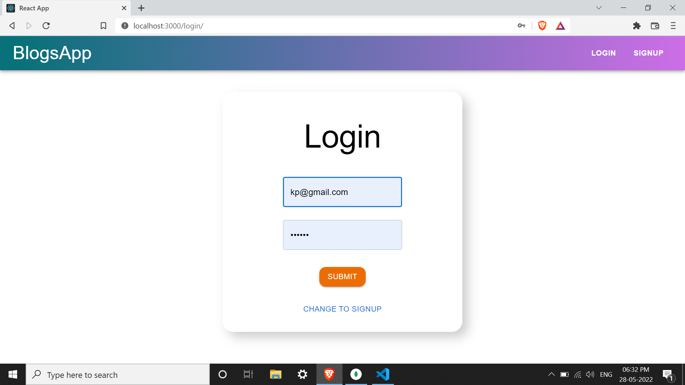

# Welcome to Blogs!

Hi! I'm Tanish Neema, with my teammates, Tanishq Mishra, Vansh Awasthi and Abhay Singh, the creator of the project **Blogs**. If you want to learn about Blogs, you can read this file. If you want to make your own project, you can edit the files as follows.

## Install Dependencies

**For Backend** - `cd server` `npm i --legacy-peer-deps`

**For Frontend** - `cd client` `npm i --legacy-peer-deps`

## Env Variables

**For Backend** - `cd server` `nodemon server.js`

**For Frontend** - `cd client` `npm run start`

## Author

I am Tanish Neema, Student of Jaypee University of Enigineering and Technology, Guna, Pursuing my B.Tech. 3rd Year in Computer Science and Engineering, Batch 2020-2024. 
[**Instagram**](https://instagram.com/tanish_neema?igshid=NDk5N2NlZjQ=) 
[**Facebook**](https://www.facebook.com/tan.neema/) 
[**GitHub**](https://github.com/tanishneema) 
[**Linkedin**](https://www.linkedin.com/in/tanish-neema/) 

# Blog-App-using-MERN-stack

Blog App

# Functionalities

- Authentication  
- Create blog  
- Delete Blog  
- Update Blog  
- View other user blog  

# Screenshots

  
  

